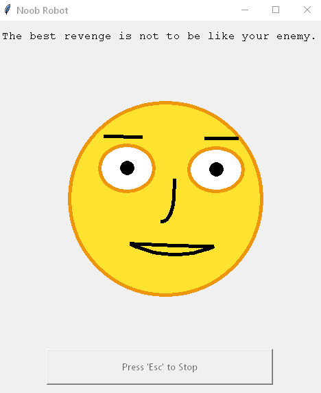

# Social Robot Simulator

This is a social robot simulator. The robot will read your facial features and response to your faicial expression.

The robot has 3 major features:
- Have Eye Contact
- Mirror the facial expression
- Response to the user's general mood

This is the experiment for the Robotics class. For the motivation and result of the experiment, please refer to the [paper](https://docs.google.com/document/d/1HIo6LvlpRLJwEblgGRwHfYLCtfQ8PtXHWuiufsKPKX0/edit?usp=sharing)


## Installation

1. Use Anaconda to install the packages for running the program (For Windows, we recommend using the Anaconda Prompt)
```shell script
conda create -name ENVNAME
conda activate ENVNAME
conda install -c conda-forge opencv # Install opencv
conda install -c conda-forge dlib
```

2. Run the robot simulation using Python3
```shell script
python main.py
```

3. The dataset we use can be found in data_source.zip. If you want to train a dataset for emotion recognition, run:
```shell script
python mood_tracker/train.py
```

## Credit
This project use `dlib` and `opencv` for the computer vision function
